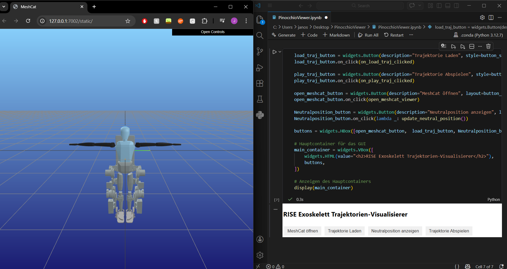

# RISE Exoskelett Trajektorien-Visualisierer

A Jupyter Notebook-based tool for visualizing robot motion and analyzing spline-based trajectories, developed as part of a robotic locomotion project.



---

## What it does

- Loads a robot model via **URDF** and renders it in real time using **MeshCat** in the browser
- Provides a simple GUI (via `ipywidgets`) to control the viewer: open MeshCat, load trajectories, show neutral position, and play back motion
- Loads and analyzes **spline-based trajectories** for motion evaluation
- Built with **Pinocchio** for kinematics computations

---

## Requirements

Install dependencies via:

```bash
conda env create -f environment.yml --prefix .conda
conda activate .\.conda
```

---

## Usage

> ⚠️ A URDF robot model is required but **not included** in this repo (licensing). You can use any compatible URDF, for example from [example-robot-data](https://github.com/Gepetto/example-robot-data).

1. Set the path to your URDF inside the notebook
2. Run all cells
3. Use the GUI buttons to open MeshCat, load a trajectory, and play it back

---

## Background

Developed during a project on robotic locomotion, exploring trajectory generation and inverse kinematics concepts with the RISE exoskeleton.
